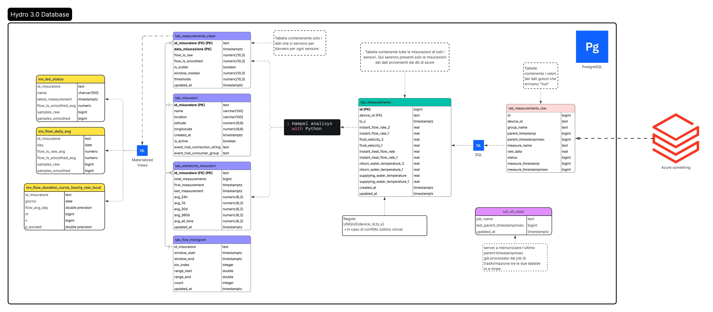

# 🏗️ Hydra 3.0 - Sistema di Monitoraggio Idrometrico

## Panoramica del Progetto

**Hydra 3.0** è una piattaforma di monitoraggio real-time per misurazioni idrologiche che combina due servizi distinti:

- **🔄 db_manager**: Servizio ETL per processamento dati real-time da Azure EventHub
- **🌐 portale_hydro_3_0**: Dashboard web Django per visualizzazione e analisi

### Funzionalità Principali
- **Pipeline ETL real-time** con processamento statistico avanzato (filtro Hampel)
- **Dashboard web** con grafici interattivi e zoom/pan
- **Analytics avanzate**: curve di durata, istogrammi di flusso, statistiche temporali
- **Monitoraggio stato**: LED status in tempo reale per ogni misuratore
- **Gestione outlier**: rilevamento automatico tramite algoritmi statistici

---

## 🗃️ Architettura Database



*Schema delle tabelle principali del sistema Hydra 3.0 con relazioni e materialized views*

---

## 🔄 Servizio db_manager (ETL Pipeline)

### Architettura
Come nei manga dovete guardare il diagramma del database da destra verso sinistra per seguire il flusso di dati in entrata.
```
Azure EventHub → tab_measurements_raw → tab_measurements → tab_measurements_clean → Analytics
```

### Componenti Principali

#### 📁 Struttura Directory
```
db_manager/
├── config/
│   └── settings.py          # Configurazione centralizzata
├── db/
│   ├── conn.py              # Gestione connessioni database
│   ├── schema.py            # Setup schema e tabelle
│   └── sql_loader.py        # Caricamento script SQL
├── jobs/                    # Job ETL individuali
│   ├── ingest_eventhub.py   # Ingestion da Azure EventHub
│   ├── transform_raw.py     # Trasformazione dati raw
│   ├── clean_measurements.py # Applicazione filtro Hampel
│   └── refresh_*.py         # Refresh materialized views
├── scripts/                 # Script SQL
│   ├── ensure_*.sql         # Creazione tabelle/MV
│   └── refresh_*.sql        # Refresh logic SQL
└── run.py                   # Orchestratore principale
```

#### 🔧 Pipeline di Processamento

**Stage 1: Ingestion** (`ingest_eventhub.py`)
- Consuma eventi JSON da Azure EventHub
- Rate limiting: 280s tra eventi per device. Più precisamente, un dato arriva ogni 5 minuti. Un piccolo gap di 20 secondi è stato lasciato in modo da evitare collisioni con i dati che arrivano, per appunto, ogni 5 minuti (300s).
- Salvataggio in `hydro.tab_measurements_raw`

**Stage 2: Transform** (`transform_raw.py`)
- Pivot dei dati raw in formato wide. Ogni misurazione è formata da 10 righe per misuratore. Ogni riga rappresenta un dato specifico come la portata o la temperatura. La trasformazione pivot consente di avere una riga per misuratore con tutte le misurazioni come colonne, facilitando l'analisi e la pulizia successiva.
- Checkpoint tracking via `hydro.tab_etl_state`
- Output in `hydro.tab_measurements`

**Stage 3: Data Cleaning** (`clean_measurements.py`)
- **Filtro Hampel** (window=49, σ=3.5) per outlier detection
- Calcolo mediane mobili e soglie statistiche
- Output in `hydro.tab_measurements_clean`

**Stage 4: Analytics** (vari `refresh_*.py`)
- Statistiche temporali (24h, 7d, 30d, 360d, all-time)
- Curve di durata con percentili di superamento
- Istogrammi di distribuzione flusso
- Materialized views per performance

#### ⚙️ Configurazione (`config/settings.py`)
```python
# EventHub
EVENTHUB_CONNECTION_STRING = os.getenv("EVENTHUB_CONNECTION_STRING")
MIN_SECONDS_BETWEEN_EVENTS = 280  # Throttling

# Hampel Filter
HAMPEL_WINDOW_SIZE = 49
HAMPEL_SIGMA_THRESHOLD = 3.5

# Scheduling
SECONDS_BETWEEN_INGEST = 20
SECONDS_BETWEEN_TRANSFORM = 60
SECONDS_BETWEEN_CLEAN_MEASUREMENTS = 300
```

#### 🕐 Orchestrazione (`run.py`)
- **Thread separati** per ogni job ETL
- **Scheduling intelligente**: real-time (20s-5min) + nightly (2-4am)
- **Timezone aware**: Europe/Rome per operazioni notturne
- **Graceful startup**: verifica schema e dependencies

---

## 🌐 Servizio portale_hydro_3_0 (Web Dashboard)

### Architettura Django

#### 📁 Struttura Directory
```
portale_hydro_3_0/
├── portale/                 # App Django principale
│   ├── models.py           # Modelli (unmanaged, puntano al DB del db_manager)
│   ├── views.py            # API endpoints e view logiche
│   ├── urls.py             # URL routing
│   ├── static/portale/
│   │   ├── css/style.css   # Styling + LED status
│   │   └── js/
│   │       ├── charts.js   # Gestione grafici Chart.js (~1400 righe)
│   │       └── led_status.js # Polling status misuratori
│   └── templates/portale/   # Template HTML
├── portale_hydro_3_0/      # Settings Django
└── manage.py
```

#### 🗃️ Modelli Dati (`models.py`)
```python
# Tabelle principali (managed=False - create dal db_manager)
class tab_measurements_clean     # Dati processati con Hampel
class tab_misuratori            # Anagrafica misuratori 
class tab_statistiche_misuratori # Statistiche aggregate
```

#### 🔌 API Endpoints (`views.py`)
```python
/api/measurements/     # Time series dati per grafici
/api/duration-curve/   # Curve di durata (percentili)
/api/flow-histogram/   # Istogrammi distribuzione
/api/led-status/       # Status real-time misuratori
```

#### 📊 Frontend JavaScript (`static/portale/js/`)

**charts.js** - Sistema grafici avanzato:
- **Chart.js** con plugin zoom e decimazione LTTB
- **3 tipologie**: Flow rate, Duration curves, Histograms
- **Gap detection**: interruzione linee + ombreggiatura rossa
- **Performance**: decimazione automatica oltre 1250 punti
- **Real-time**: polling 60s per range 24h
- **UX**: zoom, pan, reset, range buttons (24h→all)

**led_status.js** - Monitoraggio real-time:
- **Polling 60s** su `/api/led-status/`
- **Regole colore**: Verde ≤2h, Arancione >2h, Rosso >6h, Grigio no-data
- **Retry logic** con backoff esponenziale

#### 🔐 Sicurezza
- **Login required** su tutte le view (`@login_required`)
- **Input validation** robusta con whitelist e regex
- **SQL injection protection** via ORM e parametri
- **CSRF protection** Django standard

#### Riattivare il login (se rimosso)
Per ripristinare l'autenticazione:
- Ripristina i decorator `@login_required` nelle view in `portale_hydro_3_0/portale/views.py`.
- Ripristina l'import `from django.contrib.auth.decorators import login_required` nello stesso file.
- Riattiva la route auth in `portale_hydro_3_0/portale_hydro_3_0/urls.py`:
  `path("accounts/", include("django.contrib.auth.urls")),`
- Riattiva `LOGIN_URL` (e facoltativamente `LOGOUT_REDIRECT_URL`) in `portale_hydro_3_0/portale_hydro_3_0/settings.py`.

#### 🎨 User Experience
- **Responsive design** con sidebar navigazione
- **Live status indicators** per ogni misuratore
- **Interactive charts** con tooltip dettagliati  
- **Range selection** adattivo (24h→all con ottimizzazioni)

---

## 🔗 Integrazione tra i Servizi

### Flusso Dati
```
Azure EventHub → db_manager → PostgreSQL → Django ORM → Chart.js → Browser
```

### Sincronizzazione
- **Database condiviso**: Stesso schema PostgreSQL `hydro.*`
- **Modelli unmanaged**: Django non gestisce DDL, solo queries
- **Real-time updates**: Frontend polling + materialized views refresh

### Performance Strategy
- **Materialized views** per range lunghi (6m+) con medie giornaliere
- **Direct queries** per range brevi (24h-1m) con tutti i punti
- **Caching HTTP** (20h) su endpoint statici (curve di durata)
- **Decimazione client-side** con LTTB algorithm

---

## 🚀 Deployment

### Requirements
- **Python 3.11+** con virtual environment
- **PostgreSQL 13+** con schema `hydro`
- **Azure EventHub** connection string
- **Sistema operativo**: Linux/Windows con systemd/services

### Quick Start
```bash
# Setup database service
cd db_manager
pip install -r requirements.txt
python run.py

# Setup web service  
cd portale_hydro_3_0
pip install -r requirements.txt
python manage.py runserver 0.0.0.0:8000
```

### Production Deploy
- **Single machine** recommended per uso interno
- **Nginx reverse proxy** per static files e SSL
- **Systemd services** per auto-restart
- **PostgreSQL locale** (no cluster needed per 3-4 utenti)

---

## ✅ Status del Progetto secondo Claude 4

### Valutazione per Uso Aziendale (3-4 utenti)
**🎯 ECCELLENTE - 9/10** 

**Punti di Forza:**
- Architettura microservizi ben separata e manutenibile
- Processamento statistico scientificamente corretto  
- Frontend moderno con UX patterns solidi
- Over-engineered in modo positivo per robustezza

**Da Completare (5 minuti):**
- [x] Rimuovere credenziali hardcoded in `regenerate_clean_measurements_single.py`
- [x] Configurazione via environment variables

**Opzionali per Uso Interno:**
- Script restart automatico (risolve memory leak con cron)
- Health check endpoints per monitoring

---

## 🔌 Utilità Operative

### Disattivare/Riattivare CI/CD (Azure + GitHub)

**Azure App Service (Deployment Center)**
```bash
# Disattivare: Azure Portal → App Service → Deployment Center → Disconnect
# Riattivare: Azure Portal → App Service → Deployment Center → Connect (GitHub + branch release)
```

**GitHub Actions**
```bash  
# Disattivare: GitHub repo → Actions → Select workflow → Disable workflow
# Riattivare: GitHub repo → Actions → Select workflow → Enable workflow
```

### Network troubleshooting (LAN)
Se il sito funziona sul PC server ma non è raggiungibile da altri PC:
- **Profilo rete**: Imposta come "Privato" in Windows
- **Firewall**: Regola in ingresso TCP port 8000 per profilo Privato
- **Test connettività**: `Test-NetConnection <IP> -Port 8000` dal client

---

## 🤖 Servizio notifications_service (Sistema Notifiche Telegram)

### Panoramica
**notifications_service** è un servizio autonomo per il monitoraggio e alerting automatico tramite Telegram Bot. Opera indipendentemente dal portale web e dal db_manager, garantendo continuità delle notifiche anche in caso di malfunzionamenti degli altri servizi.

### Architettura
```
notifications_service/
├── config/
│   └── settings.py              # Configurazioni DB, Telegram, timezone
├── services/
│   ├── database_service.py      # Connessione PostgreSQL e query
│   └── telegram_service.py      # Gestione messaggi e formattazione
├── jobs/                        # Script per esecuzione manuale
│   ├── daily_report.py          # Rapporto completo misuratori
│   └── check_stale.py           # Controllo dispositivi offline
├── interactive_bot.py           # Bot interattivo con comandi
└── test_service.py              # Suite di test completa
```

### Tecnologie Utilizzate
- **Python 3.14+** con virtual environment
- **pyTelegramBotAPI** per interazione con Telegram Bot API
- **psycopg2** per connessione diretta a PostgreSQL
- **python-dotenv** per gestione variabili d'ambiente
- **schedule** per job periodici automatici

### Workflow del Sistema

#### 🚀 Sistema Integrato (RACCOMANDATO)
```bash
python interactive_bot.py
```
**Servizio unificato** che combina:
- **Job automatici**: Rapporti giornalieri e controlli offline schedulati
- **Bot interattivo**: Comandi on-demand per consulti immediati
- **Configurazione unificata**: Timing configurabile via variabili d'ambiente

**Job automatici integrati:**
- **Rapporto giornaliero**: Alle ore configurate (default: 08:30)
- **Controllo offline**: Ogni X minuti configurabili (default: 30 min)
- **Notifiche recovery**: Immediate quando dispositivi tornano online
- **Sistema anti-spam**: Alert solo per nuovi problemi, stato salvato in `alert_state.json`

#### ⚙️ Configurazione Scheduler
Variabili opzionali in `.env`:
```env
SCHEDULER_DAILY_REPORT_TIME=08:30        # Orario rapporto giornaliero (HH:MM)
SCHEDULER_STALE_CHECK_MINUTES=30         # Intervallo controllo offline (minuti)
SCHEDULER_CHECK_SECONDS=60               # Frequenza controllo scheduler (secondi)
```

#### 🔧 Esecuzione Manuale (ALTERNATIVA)
Per test o esecuzioni singole:

1. **Rapporto Completo**:
   ```bash
   python jobs/daily_report.py
   ```

2. **Controllo Dispositivi Offline**:
   ```bash
   python jobs/check_stale.py
   ```

#### 🤖 Solo Bot Interattivo
Per avere solo comandi senza job automatici, modificare `interactive_bot.py` commentando la sezione scheduler.
```bash
python interactive_bot.py
```
Bot attivo che risponde a comandi immediati per consulti on-demand.

### Comandi Bot Disponibili

| Comando | Descrizione |
|---------|-------------|
| `/status` | Rapporto completo di tutti i misuratori (equivalente al rapporto giornaliero) |
| `/offline` | Lista solo misuratori offline con dettagli ultima connessione |
| `/online` | Lista solo misuratori online con medie flusso |
| `/list` | Lista completa di tutti i misuratori nel database (ID + Nome) |
| `/stats [nome]` | Dettagli completi di un misuratore specifico |
| `/time` | Data/ora corrente del sistema |
| `/chatid` | ID della chat corrente (utile per configurazione) |
| `/help` | Lista di tutti i comandi disponibili |

### Configurazione Timing e Soglie

#### ⚠️ Soglie Timeout
- **Soglia dispositivi offline**: `.env` → `TELEGRAM_STALE_THRESHOLD_HOURS=24`
- **Timezone**: `config/settings.py` → `LOCAL_TZ = ZoneInfo("Europe/Rome")`

#### 📧 Configurazione Telegram
Variabili richieste in `.env`:
```env
TOKEN_TELEGRAM_BOT=your_bot_token_here
TELEGRAM_CHAT_ID=-1234567890
TELEGRAM_STALE_THRESHOLD_HOURS=24
```

### Utilizzo e Testing

#### 🚀 Avvio Produzione
```bash
cd notifications_service
python interactive_bot.py
```
**Sistema completo attivo con:**
- Job automatici schedulati
- Bot interattivo per comandi on-demand
- Logging completo su console e file

#### 🧪 Test Completo del Sistema
```bash
cd notifications_service
python test_service.py
```

#### 📊 Esecuzione Manuale Job (per test)
```bash
# Rapporto completo stato misuratori (singolo)
python jobs/daily_report.py

# Controllo dispositivi offline (singolo)
python jobs/check_stale.py
```

#### 🤖 Avvio Sistema Completo (RACCOMANDATO)
```bash
# Sistema integrato: Bot + Job automatici
python interactive_bot.py
```
All'avvio vedrai:
- ✅ Scheduler avviato con job programmati
- 📅 Timing configurato (rapporto giornaliero + controlli offline)
- 🤖 Bot attivo per comandi immediati
- Log dettagliato di tutte le operazioni
# Bot attivo per comandi on-demand
python interactive_bot.py
```

### Monitoring e Log

#### 🔍 Log Sistema Integrato
- **Console log**: Output real-time di tutte le operazioni
- **Scheduler log**: Job automatici con timing e risultati
- **Bot log**: Comandi utente e risposte del bot
- **Error log**: Errori dettagliati con stack trace

#### 📁 File di Stato
- **Stato alert**: `alert_state.json` - Dispositivi offline tracciati per anti-spam
- **Log rapporti manuali**: `daily_report.log` - Solo per esecuzioni singole
- **Log controlli manuali**: `stale_check.log` - Solo per esecuzioni singole

#### 🧪 Diagnostica
```bash
# Test completo connettività e funzionalità
python test_service.py

# Verifica configurazione
python -c "from config.settings import *; print('Config OK')"
```

#### 📊 Esempio Output Sistema Integrato
```
🤖 Avvio Hydra Bot con scheduler integrato...
📅 Job programmati:
  - Rapporto giornaliero: 08:30
  - Controllo offline: ogni 30 minuti
✅ Scheduler avviato
🔍 Controllo dispositivi offline automatico
📊 Esecuzione rapporto giornaliero automatico
```

### Resilienza e Affidabilità
- **Servizio autonomo**: Funziona indipendentemente da portale web e db_manager
- **Sistema anti-spam**: Evita notifiche ripetitive per stessi problemi
- **Retry automatico**: Gestione errori di rete Telegram con backoff
- **Chunking messaggi**: Supporto messaggi lunghi con divisione automatica
- **Gestione errori**: Alert automatici per problemi di sistema via Telegram
- **Esecuzione on-demand**: Job eseguibili manualmente per testing e verifica

---

---

## Pelton Turbine Data & Yield Curves (data_pelton_yield)

This section documents the JSON structure used to configure Pelton datasets. If you switch to JSON, use this schema.

```json
{
  "DBCAN": {
    "name": "Canaletta",
    "path": "csv_all\\raw\\DBCAN.csv",
    "path_filtered": "csv_all\\h_fixed\\DBCAN_filtered_H_fixed.csv",
    "head": 117,
    "flow": [],
    "yield": []
  },
  "DBPAR": {
    "name": "Partitore",
    "path": "csv_all\\raw\\DBPAR.csv",
    "path_filtered": "csv_all\\h_fixed\\DBPAR_filtered_H_fixed.csv",
    "head": 346.24,
    "flow": [],
    "yield": []
  },
  "DBST": {
    "name": "San Teodoro",
    "path": "csv_all\\raw\\DBST.csv",
    "path_filtered": "csv_all\\h_fixed\\DBST_filtered_H_fixed.csv",
    "head": 347.24,
    "flow": [],
    "yield": []
  }
}
```

Field meanings:
- `DBCAN`, `DBPAR`, `DBST`: plant identifiers. Each key maps to a plant configuration object.
- `name`: human-readable plant name.
- `path`: relative path to the raw input CSV for that plant.
- `path_filtered`: legacy output path for H_fixed processing (currently not used in the H_calculated flow).
- `head`: fixed head value in meters (historical reference; H_calculated uses pressure instead).
- `flow`: reserved list for flow values (currently unused).
- `yield`: reserved list for efficiency values (currently unused).

---

## Curva di Rendimento: Problema Reale e Funzione di Fit

### Problema che stiamo risolvendo
I dati reali di rendimento (η) in funzione della portata (Q) sono rumorosi e non seguono una forma perfettamente simmetrica:
- a basse portate la curva cresce rapidamente
- vicino al picco si stabilizza
- a portate alte scende piu lentamente

Per il portale serve una **funzione continua e stabile** che approssimi i dati reali e permetta:
- simulazioni rapide (dato Q, ottengo η)
- confronti tra impianti
- grafici puliti e interpretabili

### Funzione originale (simmetrica)
```
?(x) = ?_max * (1 - a (x - 1)^2)
```
dove:
- `x = Q / Q_max`
- `?_max` = rendimento massimo
- `a` = coefficiente di curvatura

Questa formula e' semplice ma troppo rigida: impone simmetria e tende a partire da valori troppo alti.

### Funzione aggiornata (asimmetrica, picco a x=1)
Per seguire meglio i dati reali, usiamo una versione **asimmetrica** a sinistra/destra del picco:
```
Left (x<=1):
? = ?0 + (?_max - ?0) * (1 - aL * |x - 1|^kL)

Right (x>1):
? = ?0 + (?_max - ?0) * (1 - aR * |x - 1|^kR)
```

Interpretazione dei parametri:
- `?0`: rendimento di base (stimato dal 5? percentile)
- `?_max`: media del top 5% dei rendimenti (robusta al rumore)
- `Q_max`: portata corrispondente al picco di rendimento osservato
- `aL`, `aR`: curvatura a sinistra e destra del picco
- `kL`, `kR`: esponenti che controllano quanto rapidamente la curva scende

### Funzione aggiornata (asimmetrica, x normalizzato 0..1 con picco interno)
Per avere un asse x normalizzato tra 0 e 1, usiamo:
```
x = (Q - Q_min) / (Q_max - Q_min)
```
Il picco non e' in x=1, ma in un valore interno `x0`:
```
x0 = argmax(?) nella scala normalizzata
```
La formula diventa:
```
Left (x<=x0):
? = ?0 + (?_max - ?0) * (1 - aL * |x - x0|^kL)

Right (x>x0):
? = ?0 + (?_max - ?0) * (1 - aR * |x - x0|^kR)
```

Questa versione permette:
- range 0..1 sull'asse x
- picco nella posizione reale dei dati
- confronto diretto tra impianti con scale normalizzate

### Calcolo dettagliato delle curve di fit

**Dati in ingresso**
- Si usa la curva media: `Portata_bin` (Q) e `Rendimento_mean` (?) dal CSV `rendimento_medio_per_turbine_pelton.csv`.
- Vengono esclusi gli outlier (`Rendimento_mean_is_outlier == True`) e i valori non fisici (? < 0 o ? > 1).

**Normalizzazione dell'asse x (0..1)**
```
Q_min = min(Q)
Q_max = max(Q)
x = (Q - Q_min) / (Q_max - Q_min)
x0 = argmax(?) nella scala normalizzata
```

**Stima di ?_max e ?0**
- `?_max` = media del **top 5%** dei rendimenti (piu' robusto del max assoluto)
- `?0` = **5? percentile** dei rendimenti (base della curva)

**Curva simmetrica**
Si impone una forma simmetrica attorno al picco `x0`:
```
? = ?0 + (?_max - ?0) * (1 - a (x - x0)^2)
```
Il coefficiente `a` si calcola con una formula chiusa:
```
z = (x - x0)
b = ? [ z^2 * (?_max - ?) ] / ? [ z^4 ]
a = b / (?_max - ?0)
```

**Curva asimmetrica (sinistra/destra)**
La versione asimmetrica permette due curvature diverse:
```
Left (x<=x0):
? = ?0 + (?_max - ?0) * (1 - aL * |x - x0|^kL)

Right (x>x0):
? = ?0 + (?_max - ?0) * (1 - aR * |x - x0|^kR)
```
I parametri `kL`, `kR` vengono scelti con una **grid search** nel range [2..7] con step 0.25.
Per ogni coppia (kL, kR) si calcolano `aL` e `aR` con formula chiusa:
```
zL = |x - x0|^kL   (solo x<=x0)
zR = |x - x0|^kR   (solo x>x0)

bL = ? [ zL * (?_max - ?) ] / ? [ zL^2 ]
bR = ? [ zR * (?_max - ?) ] / ? [ zR^2 ]

aL = bL / (?_max - ?0)
aR = bR / (?_max - ?0)
```
La coppia (kL, kR) che minimizza l'errore quadratico totale viene selezionata.

---

## Flusso Dati Rendimento/Potenza (Portale)

Questa sezione descrive come le varie parti (frontend, backend, DB) interagiscono per mostrare rendimento e potenza nel portale.

### 1) Frontend
- La pagina del misuratore carica `charts.js` e `rendimento.js`.
- `rendimento.js` legge `id_misuratore` dal canvas (attributo `data-misuratore`).
- Fa una chiamata HTTP:
  ```
  /portale/api/rendimento-potenza/?id_misuratore=...
  ```

### 2) Backend (Django)
- `urls.py` mappa l'endpoint su `rendimento_potenza_api`.
- La view:
  - valida `id_misuratore`
  - calcola **media portata ultimi 30 min**
  - legge **parametri di fit** della turbina
  - calcola `η` e `P`
  - ritorna JSON con valori numerici

Esempio risposta:
```
{
  "flow_ls_avg_30m": 12.3,
  "eta": 0.74,
  "power_kw": 26.6,
  "head_m": 183,
  "x": 0.31
}
```

### 3) Database
Il backend legge da:
- `tab_measurements_clean` (portata ultimi 30 min)
- `tab_misuratori` (nome impianto)
- `tab_impianti`, `tab_turbine`, `tab_turbina_parametri` (parametri fit)

### 4) Frontend aggiorna UI
- `rendimento.js` aggiorna i campi della tabella:
  - Rendimento medio 30 min
  - Potenza attesa 30 min
  - Salto H (default DB, modificabile)
- Se l'utente cambia H, la potenza viene ricalcolata lato client.

### Perche serve nel portale
Con questa funzione l'utente puo:
- inserire una portata Q e ottenere un rendimento stimato
- calcolare la potenza attesa (P = ρ * g * H * Q * η)
- confrontare curve di impianti diversi con una logica coerente

